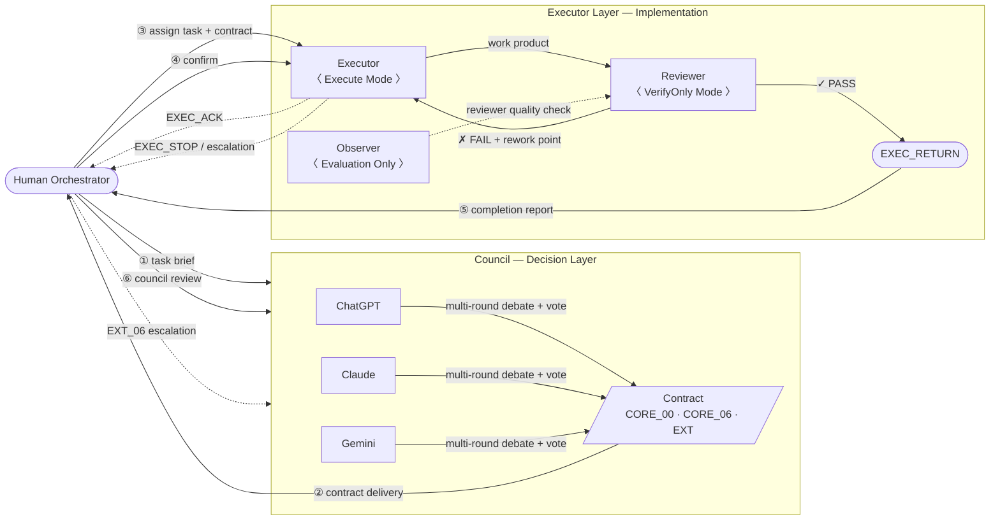
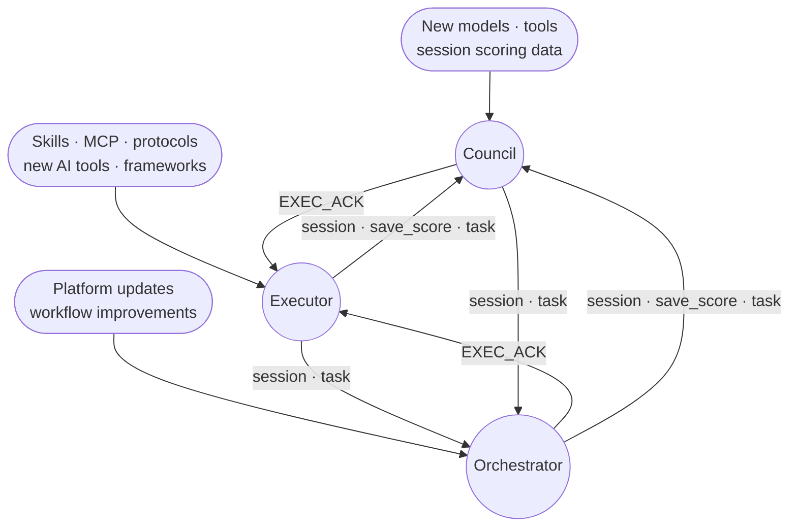

# H.E.L.M — AI Orchestration Workbench

**Human-Executed Layered Multi-model**

Most multi-model AI setups fail the same way: no accountability between models, no handoff discipline when sessions break, no way to verify that outputs actually match the task. H.E.L.M solves this with a structured three-layer system that keeps decision quality and execution quality separate, auditable, and resumable.

This is not a prompt template. It is a working system with defined protocols, layered authority, and traceable records built up over 120+ real sessions.

## Architecture



| Layer | Role | Members |
|---|---|---|
| Council | Debate, vote, produce contracts, final review | ChatGPT · Claude · Gemini |
| Orchestrator | Route, confirm, escalate | Human |
| Executor | Execute · Review · Observe | Any available model |

## Mutual Optimization Loop

Each layer continuously reviews and optimises the others. External capabilities — new tools, protocols, models — are absorbed at the layer where they are most useful.



No layer operates in isolation. Every layer is accountable to the other two.

## Why The Structure Matters

The interesting part is not that H.E.L.M has three layers. The interesting part is that **the boundaries kept proving useful under repeated real work**.

- The council layer stayed focused on framing, comparison, criticism, and delivery discipline.
- The executor layer kept getting thicker where thickness actually helped: clearer execution states, stronger handoff structure, better verification boundaries, and better traceability.
- The orchestration layer kept more native artifacts instead of relying on memory or paraphrase, which made the whole system easier to resume, audit, and improve.

That is also why H.E.L.M could absorb ideas from adjacent systems without collapsing into prompt bloat. When outside examples exposed a strong mechanism, H.E.L.M did not need a total rewrite. The underlying layer model was already sound enough to take in targeted improvements with low structural shock.

## What Makes H.E.L.M Different

| Problem | Common approach | H.E.L.M |
|---|---|---|
| AI models give inconsistent outputs | Average or pick one | Structured debate + formal vote |
| Work breaks when session ends | Start over | Handoff protocol — resumable by any executor |
| No way to verify AI output quality | Trust or spot-check | Built-in Reviewer + Observer roles |
| Scope creep in AI tasks | Better prompting | Formal contracts with frozen scope |
| Can't tell why a decision was made | Chat logs | Traceable audit trail per task |

## Executor Role Split

H.E.L.M treats the execution side as three distinct roles, not one flat "assistant."

- **Executor** — pushes implementation forward under approved scope
- **Reviewer** — verifies claims against file reality and runnable evidence; read-only
- **Observer** — watches blast radius and stage discipline; evaluates reviewer quality

This role split costs extra tokens. The tradeoff is worth it because it prevents a more expensive failure mode: long debugging loops caused by weak review, blurred authority, or untracked stage drift.

## The Records Are The Asset

One of the strongest parts of H.E.L.M is how much native process data it preserves across 120+ sessions.

- Task folders preserve contracts, review notes, findings, and staged outputs.
- Executor records trace how decisions became actions and how actions were verified.
- Session archives create a replayable history of multi-model deliberation.

That matters because the long-term direction is not "keep the human manually stitching everything forever."

1. A human gives a raw request.
2. A local middle layer compresses, routes, tracks, and preserves it.
3. Council stays focused on judgment.
4. Executors stay focused on delivery.
5. The human remains in control — the orchestration burden gets lighter.

## Run The Public Platform

```bash
cd user/platform
npm install
npm run ui
```

Then open `http://127.0.0.1:3030`.

Local browser login state is intentionally not included in this repository and should stay machine-local.

## Public Boundaries

- This is a curated public slice, not the full working archive.
- Private identities, machine-local paths, browser data, and personal operating traces are removed.
- The public naming surface uses `Claude`, `Gemini`, and `ChatGPT`.
- The goal is to show why H.E.L.M works, how the layers cooperate, and how the system has matured — without publishing the full private operating history.

## Contributors

This public repository includes substantial contribution from the following AI collaborators:

- Claude
- Gemini
- ChatGPT

