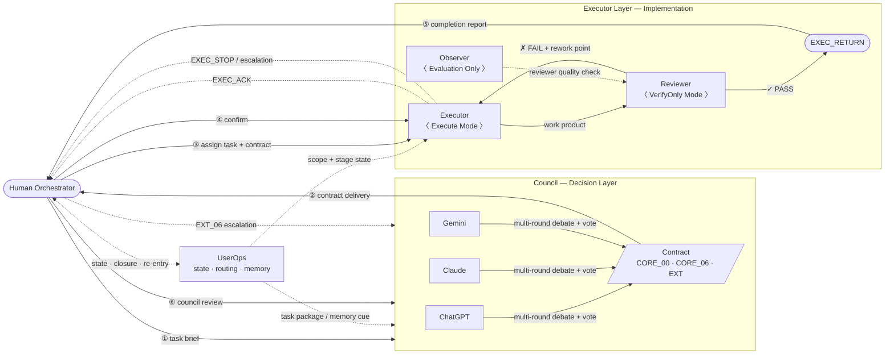
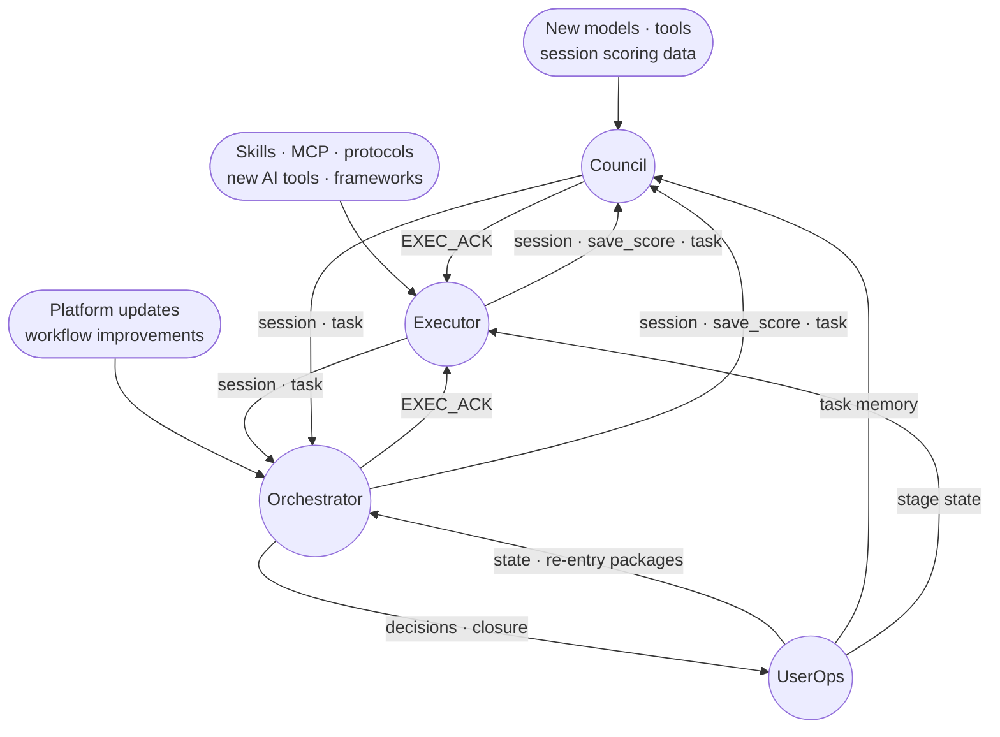

# H.E.L.M — AI Orchestration Workbench

**Human-Executed Layered Multi-model**

Most multi-model AI setups fail the same way: no accountability between models, no handoff discipline when sessions break, no way to verify that outputs actually match the task, and no durable memory of why a task moved the way it did. H.E.L.M solves this with a layered system that keeps decision quality, execution quality, and operational continuity separate, auditable, and resumable.

This is not a prompt template. It is a working system with defined protocols, layered authority, and traceable records built up over 120+ real sessions.

## Architecture



| Layer | Role | Members |
|---|---|---|
| Council | Debate, vote, produce contracts, final review | ChatGPT · Claude · Gemini |
| Orchestrator | Route, confirm, escalate | Human |
| UserOps | Preserve task state, decision records, closure learning, and re-entry signals | File-backed operations layer |
| Executor | Execute · Review · Observe | Any available model |

## Mutual Optimization Loop

Each layer continuously reviews and optimises the others. External capabilities — new tools, protocols, models — are absorbed at the layer where they are most useful.



No layer operates in isolation. Every layer is accountable to the other two.

## Why The Structure Matters

The interesting part is not that H.E.L.M has three layers. The interesting part is that **the boundaries kept proving useful under repeated real work**.

- The council layer stayed focused on framing, comparison, criticism, and delivery discipline.
- The executor layer kept getting thicker where thickness actually helped: clearer execution states, stronger handoff structure, better verification boundaries, and better traceability.
- The orchestration layer kept more native artifacts instead of relying on memory or paraphrase.
- The operations steward layer turned those artifacts into a durable task-state and learning surface.

That is also why H.E.L.M could absorb ideas from adjacent systems without collapsing into prompt bloat. When outside examples exposed a strong mechanism, H.E.L.M did not need a total rewrite. The underlying layer model was already sound enough to take in targeted improvements with low structural shock.

## What Makes H.E.L.M Different

| Problem | Common approach | H.E.L.M |
|---|---|---|
| AI models give inconsistent outputs | Average or pick one | Structured debate + formal vote |
| Work breaks when session ends | Start over | Handoff protocol — resumable by any executor |
| No way to verify AI output quality | Trust or spot-check | Built-in Reviewer + Observer roles |
| Scope creep in AI tasks | Better prompting | Formal contracts with frozen scope |
| Can't tell why a decision was made | Chat logs | Traceable audit trail per task |
| Repeated tasks lose lessons | More reminders | File-backed memory candidates, traps, routine checks, and closure records |
| Evidence invalidates the plan | Improvise | Explicit Council re-entry path |

## Executor Role Split

H.E.L.M treats the execution side as three distinct roles, not one flat "assistant."

- **Executor** — pushes implementation forward under approved scope
- **Reviewer** — verifies claims against file reality and runnable evidence; read-only
- **Observer** — watches blast radius and stage discipline; evaluates reviewer quality

This role split costs extra tokens. The tradeoff is worth it because it prevents a more expensive failure mode: long debugging loops caused by weak review, blurred authority, or untracked stage drift.

## The Records Are The Asset

One of the strongest parts of H.E.L.M is how much native process data it preserves across 120+ sessions.

- Task folders preserve contracts, review notes, findings, and staged outputs.
- Executor records trace how decisions became actions and how actions were verified.
- Session archives create a replayable history of multi-model deliberation.

That matters because the long-term direction is not "keep the human manually stitching everything forever."

1. A human gives a raw request.
2. A local middle layer compresses, routes, tracks, and preserves it.
3. Council stays focused on judgment.
4. Executors stay focused on delivery.
5. The human remains in control — the orchestration burden gets lighter.

## UserOps Layer

The newest public slice adds the missing operational spine between raw human routing and formal Council/Executor work.

This layer does not vote. It does not implement. It does not overrule review gates. Its job is to keep the system coherent across time:

- task state files for active work
- decision ledgers when the human changes scope or accepts risk
- re-entry warnings when evidence breaks the contract
- closure summaries before context disappears
- memory candidates for reusable lessons
- trap archives for repeatable failure patterns
- routine checks for stale contracts, unclosed tasks, and template drift

That is a major step. H.E.L.M is no longer just a strong council plus a strong executor protocol. It now has a durable UserOps layer that makes the whole system less dependent on one perfect chat window or one perfect human memory.

Public UserOps files:

- [UserOps README](userops/README.md)
- [UserOps Charter](userops/USEROPS_CHARTER.md)
- [UserOps task templates](userops/templates/)

## Local Role-Pack Experiment

H.E.L.M has also tested a local/API-based role-pack path for Council and Executor participants.

The experiment used file-based identity packs, session folders, strict write boundaries, and nonce-based submissions so CLI/API-hosted models could enter the same Council or Executor roles without owning the source system. The result was not a replacement for the main platform, but it proved an important architectural point: H.E.L.M's layer identity can survive a runtime change.

That matters for the next phase. If a model enters through a browser, a terminal, an API-backed CLI, or a future local runtime, the important question is not where the model came from. The important question is whether it can hold the right layer boundary.

Public case notes:

- [Operations stewardship rollout](council/task/operations-stewardship-rollout/README.md)
- [Local role-pack experiment](council/task/local-role-pack-experiment/README.md)

Public structure and prototype entry:

- [H.E.L.M structure map](H.E.L.M_structure.md)
- [Test environment role-pack prototype](test_environment/README.md)

## Run The Public Platform

```bash
cd user/platform
npm install
npm run ui
```

Then open `http://127.0.0.1:3030`.

Local browser login state is intentionally not included in this repository and should stay machine-local.

## Contributors

| | Model | Role |
|---|---|---|
| [](https://github.com/openai) | ChatGPT | Council · Executor |
| [](https://github.com/anthropics) | Claude | Council · Executor |
| [](https://github.com/google-gemini) | Gemini | Council · Executor |

## Public Boundaries

- This is a curated public slice, not the full working archive.
- Private identities, machine-local paths, browser data, and personal operating traces are removed.
- The public naming surface uses `Claude`, `Gemini`, and `ChatGPT`.
- The goal is to show why H.E.L.M works, how the layers cooperate, and how the system has matured — without publishing the full private operating history.

## Contributors

This public repository includes substantial contribution from the following AI collaborators:

- Claude
- Gemini
- ChatGPT

